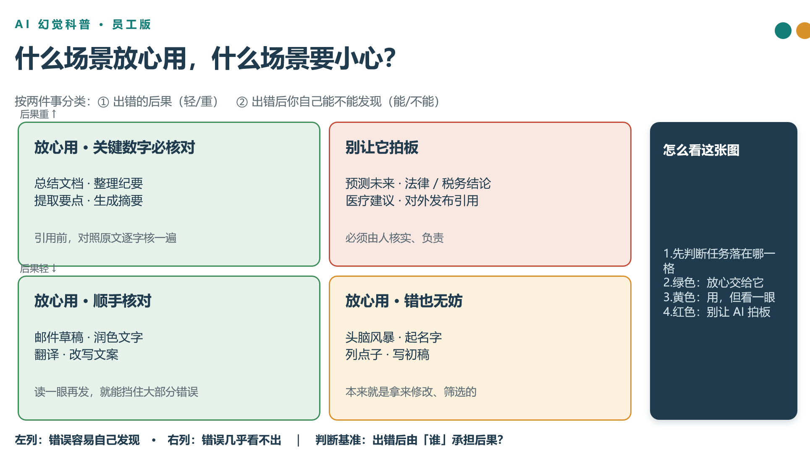

## Experiment

Claude code + Deepseek-V4-Flash
设置 endpoint，把 CC 的所有 LLM request 都路由到 localhost 的程序

```
claude (CLI)  ──►  localhost:8888 (logger.js)  ──►  api.deepseek.com/anthropic
                          │
                          ├─► api-requests.jsonl   （每行一个请求）
                          └─► api-responses.jsonl  （每行一个响应，靠 id 关联）
```

用户 request:
```
请制作一份 10 页的科普演示文稿，向没有技术背景的公司员工解释：
“大语言模型为什么有时会产生幻觉？”
要求：
受众不懂机器学习
不使用数学公式
不使用超过 20 个字的技术术语而不解释
用一个贯穿全篇的生活化类比
解释幻觉产生的至少三个原因
说明哪些使用场景风险较低，哪些风险较高
给出员工可以执行的五条核验方法
至少使用两个原创示意图
不要把模型拟人化成“真正理解”或“故意撒谎”
最后一页设计成可打印的检查清单
输出完整、可编辑的 PPTX 文件
```

## Claude code Harnesss

```
每次 LLM raw request =
  system[]  3 block / 6,715 B      ┐
  tools[]   31 个 schema / 96 KB   ┘ 42/42 逐字节相同
  messages[]  append-only，历史逐字节冻结
      └─ 每轮 +3:
          assistant  ← 上一轮 response 逐字回放（thinking + signature + text + tool_use）
          user       ← tool 输出，Harness拼接加工
          system     ← <total_tokens>，每 6–7 轮没碰 Task 工具时前置待办提醒
```

### System and tools

- `system[0]`: 70B, 计费头，包括一些指纹，不会给模型看
- `system[1]`: 57B, 身份声明，You are Claude Code, Anthropic's official CLI for Claude.
- `system[2]`: 6356 B，正文
    - 开头: 角色定义 + 安全边界，防御性安全要做，破坏性技术拒绝
    - 行为准则: 很细节，但主要是代码相关。例如“写代码要贴合周边风格”，“代词未知时用 they/them 且不许从名字推断”，“删改前先看目标”
    - Memory: 一整套文件式记忆的规格说明
    - Environment: 运行时拼的机器状态：cwd、是否 git repo、平台、shell、内核版本
    - context management: 告知长会话会被摘要；做事态度：信息够了就动手

- `tools[]`: 96 KB，31 个 tools，包括 Read, Edit, Write, Bash 等

### PPTX skills

SKILL.md 全文共 20,257 B

#### 2.1 路线决策表

| 任务 | 方式 |
|---|---|
| **Create** 新 deck | 写 `pptxgenjs` 脚本 |
| **Edit** 现有 deck / 套模板 | unzip → 改 `ppt/slides/slideN.xml` → zip |
| **Read** 内容 | `markitdown deck.pptx`；缩略图 `scripts/thumbnail.py` |

#### 2.2 五个脚本的入口和用途

| 脚本 | 作用 |
|---|---|
| `scripts/thumbnail.py` | 带标注的幻灯片缩略图网格，用于挑模板版式 |
| `scripts/add_slide.py` | 复制幻灯片并完成全部包内登记 |
| `scripts/clean.py` | 清理孤儿 slide / media / rels |
| `scripts/office/validate.py` | schema、关系、content-type、图表校验，每条失败附修法 |
| `scripts/office/soffice.py` | LibreOffice 包装器（裸 `soffice` 在沙箱里会挂） |

#### 2.3 pptxgenjs 的 16 条坑

占正文最大篇幅，按性质分三类：

**会直接损坏文件**
- hex 颜色带 `#`，或把 alpha 烘进 8 位 hex（`"00000020"`）
- shadow `offset` 为负（向上投影要用 `angle: 270` + 正 offset）
- stacked bar/column 上 `dataLabelPosition: "outEnd"`
- combo 图用 `secondaryValAxis` 但只给 `valAxes` 不给 `catAxes`
- 重排 `<p:presentation>` 的子元素顺序

**静默失效**
- `pres.layout` 必须在 `addSlide` 之前设。默认画布是 `LAYOUT_16x9` = 10″ × 5.625″，**不是** 13.3″ 宽；越界坐标不裁剪，形状直接从幻灯片上消失
- `letterSpacing` 被忽略，真名是 `charSpacing`
- `rectRadius` 只对 `ROUNDED_RECTANGLE` 生效，对 `RECTANGLE` 无效
- 不支持渐变填充（要用渐变图片当背景）

**行为陷阱**
- options 对象会被**就地 mutate** 成 EMU，不能跨 `add*` 调用复用同一个 `shadow`/options 对象
- 一个 `new pptxgen()` 实例只能产出一个文件
- 文本框有内建 padding，与形状/线条对齐时必须 `margin: 0`
- 列表用 `bullet: true`，不要写字面 `•`（会双重项目符号）；间距用 `paraSpaceAfter` 而非 `lineSpacing`
- 演讲者备注走 `slide.addNotes()`，不要放进文本框
- 图表保持 native（`addChart()`），只有 PowerPoint 无原生形式的（Sankey、网络图、和弦图）才转图片
- 图标管线：`react-icons` → `ReactDOMServer.renderToStaticMarkup` → `sharp` 栅格化 ≥256px → `addImage({ data: "image/png;base64," + ... })`

#### 2.4 模板编辑流程

unzip → `add_slide.py` → 编辑 `<p:sldIdLst>` → `clean.py` → 从目录**内部** zip → `validate.py --original`。

配套约束：所有结构性操作（增/删/排序）必须在编辑内容**之前**完成；XML 变换要用 `defusedxml.minidom`（`xml.etree.ElementTree` 会重写命名空间前缀并损坏 deck）。

python-pptx 的三个做不到：无法复制 slide、`text_frame.text = "..."` 会把段落塌成无样式单 run、读不了模板常用的 SVG/EMF。

#### 2.5 设计规范

10 套配色表（Midnight Executive、Forest & Moss、Coral Energy…）、版式清单（双栏、图标行、2×2 网格、半出血图）、间距规则（0.5″ 最小边距、0.3–0.5″ 块间距）。

外加一份「AI 味」负面清单：

- **禁止**标题下方的装饰性下划线
- **禁止**装饰色条 / 侧边竖条 / 卡片单边描边
- 不要默认蓝色、不要默认米色背景、不要居中正文、不要纯文字页

#### 2.6 字体安全名单（一条元规则）

写进 pptx 的字体名由**用户的 PowerPoint** 渲染，而本地 Visual QA 走 **LibreOffice 替换**。替换字体宽度不同 ⇒ **溢出检查本身不可信**。

| 类别 | 字体 |
|---|---|
| QA 可信（且随 Office 分发） | Arial, Calibri, Cambria, Times New Roman, Courier New, Bookman Old Style, Century Schoolbook |
| QA 不可信（替换宽度不同） | Georgia, Trebuchet MS, Impact, Arial Black, Garamond, Consolas, Palatino Linotype, Calibri Light |
| 永不使用 | Aptos（两端都不可靠） |

#### 2.7 三段式 QA

```bash
# Content QA
markitdown output.pptx
markitdown output.pptx | grep -iE "\bx{3,}\b|lorem|ipsum|\bTODO|\[insert"

# File QA
python scripts/office/validate.py output.pptx

# Visual QA
python scripts/office/soffice.py --headless --convert-to pdf output.pptx
rm -f slide-*.jpg
pdftoppm -jpeg -r 150 output.pdf slide
ls -1 "$PWD"/slide-*.jpg
```

并规定：改完只重新渲染改动过的页。


### Step messages

#### 阶段一 · 加载技能与设计定稿 — R1–R2

`2 轮 · 162s · thinking 37,435 字符 · Skill ×1 + Bash ×1`

拿到需求后没有立刻动手，先 `Skill(document-skills:pptx)` 把 19.7K 字符的官方技能正文拉进上下文。真正的重头在 R2：一次调用里烧了 **36,532 字符 thinking、159 秒**，把整份 deck 从头设计完——选定「手机输入法联想」作为贯穿全篇的类比、拆出 4 个幻觉成因、排定 10 页大纲、定下配色和两个原创示意图的构图。这一轮的 tool call 反而是个不起眼的 `require('pptxgenjs')` 探针，等于设计收尾时顺手打响了环境探测的第一枪。整个流程的智力密度集中在这里：一轮就占了全程 thinking 的 40%。

#### 阶段二 · 环境摸底 — R3–R7

`5 轮 · 31s · thinking 1,283 字符 · Bash ×5`

纯试错，每轮 thinking 都只有一两百字符。链条是：`require` 失败 → `find` 确认没预装 → `npm install`（装上了但 `version` 是 undefined）→ `typeof p` 得到 `function` → 猜到是构造函数，`new p().ShapeType` 才有形状表 → 最后逐个探测 `roundRect/ellipse/rightArrow/triangle/cloud/chevron` 是否存在。五步全部是"猜一个假设 → 用最小命令证伪"，没有一步是搜索或问人。值得注意的是它在动笔前就把要用的每个形状名验过一遍，后面 31K 字符代码一次性写完没有再回头查 API。

#### 阶段三 · 立清单、写生成器、首跑 — R8–R11

`4 轮 · 172s · thinking 21,176 字符 · TaskCreate ×3 + TaskUpdate ×1 + Write ×1 + Bash ×1`

R8 又是一次 21,089 字符的大 thinking——第一份设计稿是"讲什么"，这份是"画在哪"：逐页文案、每个形状的 x/y/w/h、字号全部敲定，然后建 3 条任务（写脚本 / 生成校验 / 视觉 QA）。R9 把 #1 翻成 in_progress，R10 **thinking 归零**，直接吐出 31,820 字符的 `make_deck.js`（单轮 85 秒、14,973 output token）——设计已经在 R8 想透了，写码阶段纯属誊抄。R11 一句 19 字符的 "Now run the script." 就跑，结果崩了。

#### 阶段四 · 修 bug 到跑通 — R12–R17

`6 轮 · 50s · thinking 8,768 字符 · Bash ×2 + Edit ×4`

报错是 `TypeError: Cannot create property 'options' on string '邮件草稿 · 润色文字'`——第 7 页把字符串数组直接喂给了 `addText`，而它要的是 `{text, options}` 对象数组。R12 做了这一整段最漂亮的动作：不猜，直接 `grep -n "lineSpacing" node_modules/pptxgenjs/dist/pptxgen.cjs.js` 去读库源码，确认 `spcPts val = lineSpacing * 100` 是点数制，回过头断言自己写的 18–22 是对的；同时在 thinking 里把其余 9 页逐页扫了一遍，确认只有第 7 页有这个模式。R13 修 bug，R14–R16 三次 Edit 是**顺带的设计改进**而非报错驱动——它发现「← 错误容易自查」的轴标签会和「后果轻 ↑」压在一起，于是把风险矩阵整个翻转，让「后果重」在上方、红色危险区落到右上角。R17 跑通。

#### 阶段五 · 机器校验与渲染 — R18–R20

`3 轮 · 13s · thinking 148 字符 · TaskUpdate ×2 + Bash ×2`

最省事的一段。翻任务状态（#1 完成、#2 开始），跑技能自带的 `validate.py` 得到 `All validations PASSED!`，再用 LibreOffice 把 10 页转成 JPG。三轮加起来 thinking 不到 150 字符——有确定性工具可用时它完全不思考，直接调。

#### 阶段六 · 读图视觉 QA — R21–R25

`5 轮 · 25s · thinking 4,187 字符 · Read ×10`

10 张图两两成对读进来，每张 150–220 KB base64。**请求体从 0.26 MB 暴涨到 2.59 MB**，而这些图片此后再没被丢弃过。R24、R25 两轮 thinking 直接为 0，翻页式地读完剩下 4 张。

这里有个值得警惕的地方：图片确实以 `image/jpeg` base64 块进了请求，但 R23 的 thinking 暴露了它实际在干什么——先写 `I'm seeing the images displayed`，接着做的却是 `40pt × 18 个汉字 ≈ 0.55"/字 × 18 = 10" < 11.9"` 这类**从 `make_deck.js` 的坐标反推几何**的算术，中间还冒出一句 `But I need to actually verify visually. The images are displayed to me — I should describe what I notice.`。它在按流程走视觉 QA 的形式，推理依据却是源码里的数字。

#### 阶段七 · 视觉问题修复与复验 — R26–R29

`4 轮 · 74s · thinking 15,760 字符 · Edit ×2 + Bash ×1 + Read ×2`

R26 单轮 54 秒、14,807 字符 thinking，逐页复盘 10 张图，最终报出两个问题：第 8 页底部警示条 **y6.6** 与页脚 **y7.12** 轻微重叠、第 2 页箭头方向不对。两个结论都是用 y 坐标表述的——延续了上一阶段"算而非看"的模式，但结论本身站得住。R27 修完，R28 一条命令串起 `生成 → 校验 → 渲染`，R29 只复看被改的第 2、8 页而不是全部重读。这种"只复验改动面"的收敛是对的，也把请求体的膨胀控制住了（3.14 → 3.16 MB）。

#### 阶段八 · 内容终检与交付 — R30–R34

`5 轮 · 44s · thinking 2,293 字符 · Bash ×2 + Read ×1 + TaskUpdate ×2`

换了个正交的检查维度：用 `markitdown` 把 pptx 全文抽出来 `grep -iE "lorem|ipsum|TODO|\[insert"`，确认无占位符残留、页数确为 10。R31 单独复看第 7 页（阶段四改动最大的一页），R32 清理临时 JPG 并 `ls` 确认产物，R33 把 #2 #3 一次性标完成，R34 `end_turn` 输出交付说明。

------

### 具体清单，每轮的 thinking, tool call , observation

- R1
    - Thinking: 用户要 10 页 PPTX 讲 LLM 幻觉，先调 pptx skill
    - Text: 我先加载 PPTX 技能，了解制作幻灯片的标准流程。
    - Call: Skill(document-skills:pptx)
    - Observation: [37] Launching skill: document-skills:pptx
        + 附加 19.7K 字符的 skill 正文（PPTX 创建/编辑/QA 全套规则）
- R2
    - Thinking: (36532 字符) 完整设计稿——选定「手机输入法猜词」类比、4 个幻觉成因、2 个原创示意图、10 页大纲、配色方案全部在 thinking 里排完；耗时 159 秒
    - Text: 我先确认环境和可用的形状类型，然后编写生成脚本。
    - Call: Bash(node -e "const p=require('pptxgenjs'); console.log(p.version)")
    - Observation: [93] Error: Cannot find module 'pptxgenjs'
- R3
    - Thinking: 不能直接 require，找找是不是预装在 skill 目录或全局
    - Call: Bash(find /home/gyp/.claude/plugins/cache/.../document-skills -maxdepth ...)
    - Observation: [60] --- /usr/local/lib/node_modules @openai --- Node.js v18.19.1
- R4
    - Thinking: 确认没预装，skill 说 pptxgenjs 是推荐库，本地装一个
    - Text: pptxgenjs 未预装，我本地安装一下。
    - Call: Bash(npm install pptxgenjs)
    - Observation: [719] Exit code 1 · added 19 packages in 495ms · version undefined
- R5
    - Thinking: 装上了但 require 回来的东西没有 version / ShapeType，探一下类型
    - Call: Bash(node -e "console.log(typeof p, Object.keys(p).slice(...))")
    - Observation: [20] function no default
- R6
    - Thinking: 是构造函数不是对象，ShapeType 大概挂在实例上
    - Call: Bash(node -e "console.log('p.ShapeType', p.ShapeType ?? new p().ShapeType)")
    - Observation: [2066] p.ShapeType no · instance methods: constructor,layout,version,…
- R7
    - Thinking: 确认 `new pptxgen().ShapeType` 有形状表，逐个探测我要用的形状
    - Call: Bash(node -e "const st=new p().ShapeType; 探测 roundRect/rect/ellipse/line/箭头/cloud/chevron")
    - Observation: [217] roundRect=true rect=true ellipse=true line=true rightArrow=true downArrow=true…
- R8
    - Thinking: (21089 字符) 第二份完整设计稿——逐页文案、每个形状的 x/y/w/h 坐标、配色十六进制值全部敲定
    - Text: 环境确认完毕。我建立任务清单并编写生成脚本。
    - Call: TaskCreate(编写 pptxgenjs 生成脚本) + TaskCreate(生成并校验 PPTX 文件) + TaskCreate(视觉 QA 并修复问题)
    - Observation: [47] Task #1 created successfully: 编写 pptxgenjs 生成脚本
        + [43] Task #2 created successfully: 生成并校验 PPTX 文件
        + [41] Task #3 created successfully: 视觉 QA 并修复问题
- R9
    - Thinking: 开始写脚本，先把任务 1 标成进行中
    - Call: TaskUpdate(#1 → in_progress)
    - Observation: [22] Updated task #1 status
- R10
    - Thinking: (空)
    - Call: Write(make_deck.js, 31820 字符)
    - Observation: [143] File created successfully at: /home/gyp/repo/playground/cc-flash/make_deck.js
- R11
    - Thinking: 跑一下脚本
    - Call: Bash(node make_deck.js)
    - Observation: [1044] Exit code 1 · pptxgenjs 内部抛错
- R12
    - Thinking: (4111 字符) 第 7 页的 `items` 传了字符串数组，但 addText 要对象数组；顺便得确认 `lineSpacing` 的单位到底是磅还是倍数
    - Text: 幻灯片 7 有 bug：`items` 传了字符串数组而 addText 期望对象数组；另外要确认 `lineSpacing` 的正确语义。先查源码。
    - Call: Bash(grep -n "lineSpacing" node_modules/pptxgenjs/dist/pptxgen.cjs.js | head -10)
    - Observation: [855] 2576: itemOpts.lineSpacing = … `spcPts val = lineSpacing * 100`
- R13
    - Thinking: 源码确认 lineSpacing 是点数制，我写的 18–22 是对的，只改 items 那个 bug
    - Text: `lineSpacing` 是点数制，我的 18–22 是合理的。现在修复第 7 页的问题。
    - Call: Edit(make_deck.js)
    - Observation: [153] The file … has been updated successfully
- R14
    - Thinking: (4133 字符) 「← 错误容易自查」和「后果轻 ↑」两个轴标会重叠；把「后果重」挪到上方让红色危险区更醒目
    - Text: 我需要调整风险矩阵的方向：把「后果重」放在上方，让红色危险区更醒目。修正象限坐标与提示。
    - Call: Edit(make_deck.js)
    - Observation: [153] The file … has been updated successfully
- R15
    - Thinking: (空)
    - Call: Edit(make_deck.js) — 改轴提示文案
    - Observation: [153] The file … has been updated successfully
- R16
    - Thinking: 再把第 7 页底部说明改成解释横轴
    - Call: Edit(make_deck.js)
    - Observation: [153] The file … has been updated successfully
- R17
    - Thinking: (空)
    - Call: Bash(node make_deck.js)
    - Observation: [20] saved: 幻觉科普-员工版.pptx
- R18
    - Thinking: 生成成功，接下来校验 + 渲染
    - Text: 生成成功。现在校验并渲染成图片做视觉 QA。
    - Call: TaskUpdate(#1 → completed) + TaskUpdate(#2 → in_progress)
    - Observation: [22] Updated task #1 status
        + [22] Updated task #2 status
- R19
    - Thinking: (空)
    - Call: Bash(python .../scripts/validate.py 幻觉科普-员工版.pptx)
    - Observation: [23] All validations PASSED!
- R20
    - Thinking: 校验过了，渲染成图片
    - Text: 校验通过。渲染成图片检查视觉效果。
    - Call: Bash(python .../scripts/render 成 jpg)
    - Observation: [361] Warning: failed to launch javaldx… · convert 完成
- R21
    - Thinking: 开始逐页看渲染图，一次读两张
    - Call: Read(slide-01.jpg) + Read(slide-02.jpg)
    - Observation: [204304] image/jpeg base64（≈149 KB）+ 「[Image: original 2001x1125, displayed at 2000x1124…]」
        + [299784] image/jpeg base64（≈219 KB）
- R22
    - Thinking: 图片确实拿到了，继续看 3、4 页
    - Call: Read(slide-03.jpg) + Read(slide-04.jpg)
    - Observation: 两张 image/jpeg base64（≈224 KB / 220 KB）
- R23
    - Thinking: (2962 字符) 逐页点评 slide 1–4 的排版、留白、字号
    - Call: Read(slide-05.jpg) + Read(slide-06.jpg)
    - Observation: 两张 image/jpeg base64
- R24
    - Thinking: (空)
    - Call: Read(slide-07.jpg) + Read(slide-08.jpg)
    - Observation: 两张 image/jpeg base64
- R25
    - Thinking: (空)
    - Call: Read(slide-09.jpg) + Read(slide-10.jpg)
    - Observation: 两张 image/jpeg base64
- R26
    - Thinking: (14807 字符) 10 页逐页视觉评估，定位出两处缺陷
    - Text: 我已查看全部 10 页。整体布局良好，发现两个需要修复的问题：1. 第 8 页底部警示条（y6.6）与页脚（y7.12）轻微重叠；2. 第 2 页注解用的 `leftArrow` 指向方向不对，应改为向上指向气泡。修复这两处。
    - Call: Edit(make_deck.js) — 改第 2 页箭头
    - Observation: [153] The file … has been updated successfully
- R27
    - Thinking: (空)
    - Call: Edit(make_deck.js) — 改第 8 页行距
    - Observation: [153] The file … has been updated successfully
- R28
    - Thinking: 重新生成、校验、渲染，重点复查第 2、8 页
    - Text: 重新生成并渲染，重点检查第 2、8 页的修复效果。
    - Call: Bash(node make_deck.js && validate.py && render)
    - Observation: [108] saved: 幻觉科普-员工版.pptx · All validations PASSED! · Overwriting…
- R29
    - Thinking: 复查这两页，顺带用 markitdown 做全文内容 QA
    - Call: Read(slide-02.jpg) + Read(slide-08.jpg)
    - Observation: 两张 image/jpeg base64
- R30
    - Thinking: 第 2 页箭头已朝上、第 8 页不再重叠，修复生效
    - Text: 修复生效。做最后的文字内容检查（markitdown 全文提取）确认内容完整、无占位符残留。
    - Call: Bash(markitdown "幻觉科普-员工版.pptx" \| grep -iE "lorem\|ipsum\|TODO\|\[insert")
    - Observation: [26] --- 占位符检查结束（无输出即通过） --- 10
- R31
    - Thinking: 10 页、无占位符，再单独复核重排过的第 7 页
    - Text: 内容完整、10 页无占位符。再重点复核第 7 页（重排后的风险矩阵）的最终效果。
    - Call: Read(slide-07.jpg)
    - Observation: 一张 image/jpeg base64
- R32
    - Thinking: (1172 字符) 第 7 页四象限、轴提示、右侧说明卡都正常
    - Text: 第 7 页渲染正确：红色危险区（预测/法律/医疗/对外发布）位于右上角醒目位置，四个象限与轴提示、右侧说明卡都正常。清理临时图片并确认最终文件。
    - Call: Bash(rm -f slide-*.jpg && ls -la 幻觉科普-员工版.pptx 幻觉科普-员工版.pdf make_deck.js)
    - Observation: [185] make_deck.js 39062 · 幻觉科普-员工版.pptx 48032 …
- R33
    - Thinking: (空)
    - Call: TaskUpdate(#2 → completed) + TaskUpdate(#3 → completed)
    - Observation: [22] Updated task #2 status
        + [22] Updated task #3 status
- R34
    - Thinking: (空)
    - Text: (932 字符) 完成。演示文稿已生成并通过全部校验。—— 交付文件清单 + 10 页结构表 + 需求逐条落实说明
    - Call: — (end_turn)

## My Harness

两个改进：
- 将 skill 融合进 system prompt，大幅压缩其他 system prompt 部分, tool use。省去每轮 role: system 的 messages。不再用多模态读图，而是用代码分析
- 在代码中加入 `qa_presentation`，一个 rule based check


### 设计

把叙事主线、页数、视觉系统、每页坐标一次性定完

### 生成

根据设计写 `gen_deck.js`

### 构建与静态验证

```bash
node gen_deck.js && python3 pptx/scripts/office/validate.py deck.pptx   # 结构合法性
markitdown deck.pptx | head -120                                        # 全文上半
markitdown deck.pptx | sed -n '120,280p'                                # 全文下半
```

先确认文件合法，再把成品全文读一遍 —— **文字内容的验收发生在看排版之前**

### 渲染与首轮扫描


```bash
rm -f deck.pdf slide-*.jpg \
  && soffice.py --headless --convert-to pdf deck.pptx \
  && pdftoppm -jpeg -r 150 deck.pdf slide && ls -1 slide-*.jpg
```

然后用 PIL + numpy 建立基线：每页取众数背景色 → 算 ink mask → 求 bbox → 四边贴边告警 + 页脚区墨迹密度。

```python
q = (a // 16 * 16).reshape(-1, 3)
bg = np.array(Counter(map(tuple, q)).most_common(1)[0][0])
ink = np.abs(a - bg).sum(axis=2) > 90
ys, xs = np.where(ink)
if xs.min() < 6: flags.append("LEFT-edge")
```

模型没有图像输入，于是把「看」实现成了程序化像素采样 —— 读的是 LibreOffice 实际渲染出的像素，不是生成脚本里写的坐标

### 深度排查与修复

从「整页有没有问题」收敛到「具体哪一处」：

```python
# step 8：在设计上应该留白的条带里数墨迹，非零即粘连
band_in("slide-08.jpg", y, y + 0.10, 0.55, 9.45, f"gap{i+1}")

# step 9：按 0.02 英寸逐行扫描，定位 y=5.0–5.6 区间的墨迹分布
for yin in np.arange(5.0, 5.6, 0.02): ...
```

## 重建复验

```bash
node gen_deck.js && validate.py deck.pptx && rm -f deck.pdf slide-*.jpg \
  && soffice.py --headless --convert-to pdf && pdftoppm -jpeg -r 150 deck.pdf slide \
  && python3 - <<'EOF'   # 只复扫改动过的 slide-08，y=4.9–5.6
```

一条命令串起「重建 → 校验 → 渲染 → 只复查改动页」。

## 全局复扫与需求审计 — steps 12–13


- **step 12** — 10 页 bbox + 边缘检查，附页数
- **step 13** — 拿原始需求的每个关键词回全文数出现次数

```bash
for kw in "原因一" "原因二" "原因三" "风险地图" "低风险" "高风险" \
          "核验" "检查清单" "输入法" "出处" "核对原文" "留痕"; do
  printf "%-12s: %s\n" "$kw" "$(markitdown deck.pptx | grep -c "$kw")"
done
pdfinfo deck.pdf | grep Pages
```

这是**语义覆盖度检查** —— harness 的 10 条规则里一条都没有对应项。

## 闸门

跑 `qa_presentation()` 的 10 项确定性检查

## Evaluation

### Token usage

- CC: Input 205K, Cache read 8M,  Output 191K
- Our harness: Input 46K, Cache read 477K, Output 34 K

用 GPT-5.6-Sol 的多模态功能做 Evaluation。但目前 evaluation 的效果欠佳，主要是无法辨析 PPT 图像逻辑

例如：


右边文字写的绿色是放心交给它，但左边绿色卡变里是“关键数字必核对”。非常明显的内在逻辑，GPT 无法发现问题。

## Future work

- Harness with PPT template 
- PPT 修改
